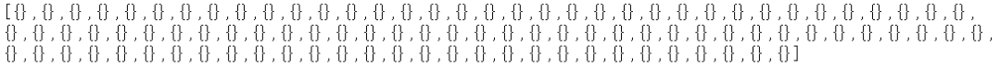
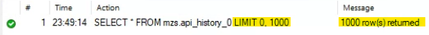
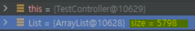

1,2,3,4 라는 컬럼을 공통으로 가진 클래스 A,B,C,D가 있다. 

abstract로 Z 클래스를 생성해 여기에 1,2,3,4를 넣어주고 @MapppedSuperClass 어노테이션을 붙어준다. 

```java
@MappedSuperclass
@Getter @Setter
public abstract class Z {
    private int 1;
    private int 2;
    private int 3;
    private int 4;
}
```
*추가 설정은 생략

나머지 A,B,C,D는 클래스를 생성하고 Z 클래스를 상속 받는다.

```java
@Entity
@Table(name = "a")
public class ApiHistory0 extends Z {
    ///1,2,3,4를 상속받음
}
```

### 참고
처음엔 각 A,B,C,D 클래스에다가 @Getter와 @Setter를 주고 추상 부모 클래스에는 주지 않고 리스트를 불러오는 메소드를 호출했다. 

ResponseBody를 사용해 JSON값이 나오길 기대했는데, 

   

위와 같이 빈 배열이 나왔다.

로그에는 값이 찍히는데 JSON에만 나오지 않아서 혹시 양이 너무 많으면 저렇게 될 수도 있나 해서 DB를 보니까 DB에는 전체 조회 했을 때 1000개 나오고 로그에서는 5000이 넘게나와서 뭔가 잘못된건가 싶었다..!

알고보니 양이 많다고 해서 저렇게 나오는 것도 아니고 개수가 서로 다른 것도 아니였다!

우선 빈값이 나오는 이슈는 추상 클래스에 Getter와 Setter 어노테이션을 설정해주니 나왔다.
  
     
그리고 DB와 로그에서 size가 너무 차이가 나서 다시 보니까 나는 message에 1000 row가 return되었다는 것만 보이고 앞에 limit되있는 것을 못봤던 것이었다 ㅠㅠ

  

  

```sql 
SELECT * FROM mzs.api_history_1 limit 5000;
```
하니까 밑에 주르륵 나왔음.. 