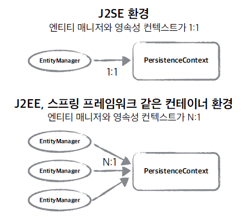
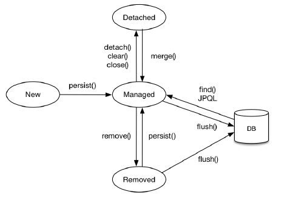
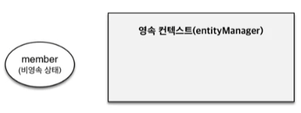
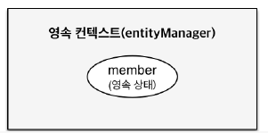

JPA에서 가장 중요한 2가지를 뽑자면
1. 객체와 관계형 데이터베이스를 어떻게 매핑할 것인가.(Object Relational Mapping) -> 설계와 관련 (정적)
2. 실제 내부에서  JPA가 어떻게 동작하는가 -> 영속성 컨텍스트 

이중 영속성 컨텍스트를 알아보자. 

JPA를 쓰게 되면 먼저 **엔티티 매니저 팩토리**와 **엔티티 매니저**를 알아야 한다.
  
  
  
한 애플리케이션을 예를 들면 고객의 요청이 들어올 때 마다 entity manager factory를 통해서 entitymanager를 생성한다. 또 새로운 요청이 들어오면 entity manager를 생성하고 그게 내부적으로 데이터 베이스 커넥션을 사용해서 DB를 사용하게 된다.

## 영속성 컨텍스트
- JPA를 이해하는데 가장 중요한 용어
- “엔티티를 영구 저장하는 환경”이라는 뜻
- EntityManager.persist(entity); -> 이 persist method는 사실 db에 저장하는게 아님, 엔티티를 **영속성 컨텍스트**라는 곳에 저장하는 거임!

엔티티 매니저? 영속성 컨텍스트?
- 영속성 컨텍스트는 <u>논리적인 개념</u>
- 눈에 보이지 않는다.
- 엔티티 매니저를 통해서 영속성 컨텍스트에 접근
  

  
엔티티 매니저를 생성하면 그 안에 1대1로  persistenceContext가 생성이 됨

## 엔티티의 생명주기 간단하게 보기
- 비영속 (new/transient)  
  영속성 컨텍스트와 전혀 관계가 없는 **새로운** 상태
- 영속 (managed)  
  영속성 컨텍스트에 **관리**되는 상태
- 준영속 (detached)  
  영속성 컨텍스트에 저장되었다가 **분리**된 상태
- 삭제 (removed)  
  **삭제**된 상태
  
    


### 비영속
  
```java
//객체를 생성한 상태(비영속)
Member member = new Member();
member.setId("member1");
member.setUsername("회원1");
``` 
  
  

JPA와 관계없이 객체 생성 후 세팅만 항 상태임 -> 비영속 상태

### 영속

```java
//객체를 생성한 상태(비영속)
Member member = new Member();
member.setId("member1");
member.setUsername("회원1");

EntityManager em = emf.createEntityManager();
em.getTransaction().begin();

//객체를 저장한 상태(영속)
em.persist(member);
``` 

  

객체 생성 -> 엔티티 매니저 호출 -> 엔티티 매니저의 persist 메소드를 통해 member를 영속 컨텍스트에 집어넣어 영속상태가 됨  
*하지만  `em.persist(member);`하여 영속상태가 되었다고 해서 바아로 DB에 쿼리를 날려 저장되는 것이 아님
**트랜젝션 커밋 이후**에 쿼리가 날라감.

### 준영속, 삭제
```java
//회원 엔티티를 영속성 컨텍스트에서 분리, 준영속 상태
em.detach(member);
```
엔티티 매니저의 detach()는 영속성 컨텍스트에서 지워버림

```java
//객체를 삭제한 상태(삭제)
em.remove(member);
```
remove는 DB에 삭제를 요청한 상태임

<br><br>

