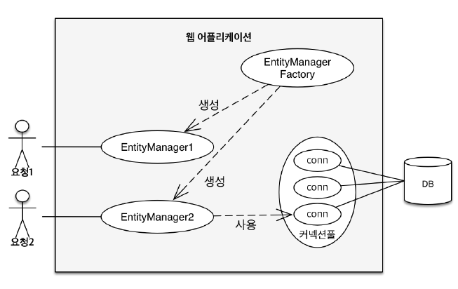

JPA에서 가장 중요한 2가지를 뽑자면
1. 객체와 관계형 데이터베이스를 어떻게 매핑할 것인가.(Object Relational Mapping) -> 설계와 관련 (정적)
2. 실제 내부에서  JPA가 어떻게 동작하는가 -> 영속성 컨텍스트 

이중 영속성 컨텍스트를 알아보자. 

JPA를 쓰게 되면 먼저 **엔티티 매니저 팩토리**와 **엔티티 매니저**를 알아야 한다.

한 애플리케이션을 예를 들어 고객의 요청이 들어올 때 마다 entity manager factory를 통해서 entitymanager를 생성한다. 또 새로운 요청이 들어오면 entity manager를 생성하고 그게 내부적으로 데이터 베이스 커넥션을 사용해서 DB를 사용하게 된다.

## 영속성 컨텍스트
• JPA를 이해하는데 가장 중요한 용어
• “엔티티를 영구 저장하는 환경”이라는 뜻
• EntityManager.persist(entity); -> 이 persist method는 사실 db에 저장하는게 아님, 엔티티를 영속성 컨텍스트라는 곳에 저장하는 거임!

엔티티 매니저? 영속성 컨텍스트?
• 영속성 컨텍스트는 논리적인 개념
• 눈에 보이지 않는다.
• 엔티티 매니저를 통해서 영속성 컨텍스트에 접근
