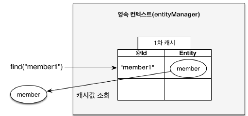
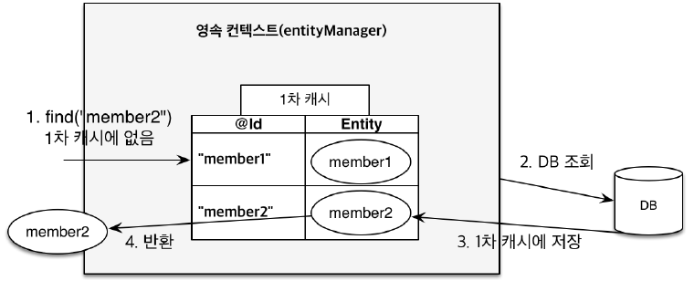
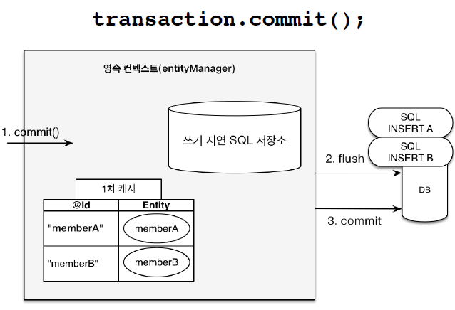
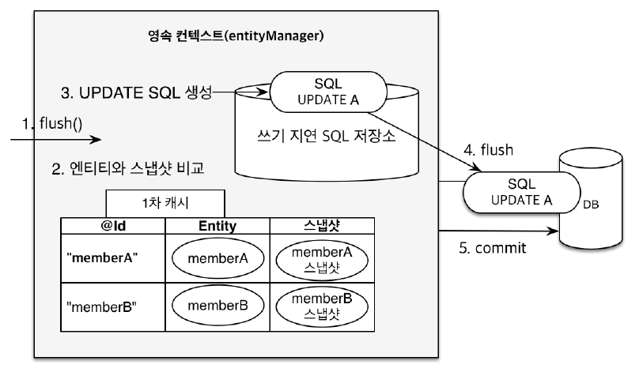

이 영속성 컨텍스트는 application과 db 사이의 중간 계층으로 볼 수 있는데 중간에 이게 있으면 왜 좋을까? 

<br>

# 영속성 컨텍스트의 이점
- 1차 캐시
- 동일성(identity) 보장
- 트랜잭션을 지원하는 쓰기 지연(transactional write-behind)
- 변경 감지(Dirty Checking)
- 지연 로딩(Lazy Loading)

<br><br>

## 1차 캐시 - 1차 캐시에서 엔티티 조회할 수 있다.
---
영속성 컨텍스트는 내부에 1차 캐시를 들고 있다. (이 1차 캐시를 영속성 컨텍스트라고 봐도 된다.)

```java
//객체를 생성한 상태(비영속)
Member member = new Member();
member.setId("member1");
member.setUsername("회원1");

EntityManager em = emf.createEntityManager();
em.getTransaction().begin();

//객체를 저장한 상태(영속)
em.persist(member);
``` 

### 캐시에서 조회  
member 객체를 영속상태로 만들면 영속성 컨텍스트에서 1차 캐시로 

```
key : @Id(PK)
value : member(객체 자체)
```

로 저장이 된다. 

```java
Member member = new Member();
member.setId("member1");
member.setUsername("회원1");

//1차 캐시에 저장됨
em.persist(member);

//1차 캐시에서 조회
Member findMember = em.find(Member.class, "member1");
``` 
이후 엔티티를 조회하고 싶을 때 `find()` 메소드를 사용하면 JPA는 먼저 영속성 컨텍스트의 1차 캐시에서 객체를 찾는다.  (DB에서 찾지 않음) 그래서 있다면 그대로 캐시값을 조회한다.


### 데이터베이스에서 조회  

```java
Member findMember2 = em.find(Member.class, "member2");
``` 
방금 시나리오에서는 member2가 1차 캐시에는 없었다.  

이처럼 DB에는 있고 1차 캐시에는 없는 경우



1. JPA가 먼저 1차 캐시에서 찾음
2. 없을 시  DB에서 조회
3. 조회한 값을 1차 캐시에 저장함
4. member2 반환  
이후에 다시 member2를 조회하게 되면 DB에서 조회하지 않고 1차 캐시에 있는 member2를 반환하게 된다. 

번외로 
```java
Member findMember1 = em.find(Member.class, 101L);
Member findMember2 = em.find(Member.class, 101L);
``` 
위와 같이 똑같은 101번 객체를 찾는다면  select문은 한 번 실행되는 것을 볼 수 있다.
findMember2번 부터는 1차캐시에서 조회하기 때문!!!

> JPA는 조회하게 되면 일단 1차캐시에 저장해놓는다.

<details>
<summary>크게 이점이 아닌 이유</summary>

사실 엔티티 매니저는 데이터 베이스 트랜젝션 단위로 만들고 그 트랜젝션이 끝나면 종료시켜버린다.   
쉽게 말해 고객의 요청이 들어와서 비즈니스 로직이 실행되고 끝난다면 영속성 컨텍스트를 지워버리는데 그 때 1차 캐시도 다 날라가기 때문에 1차 캐시에서 데이터를 조회하는 것은 그닥 큰 이점은 아니게 된다. 
하지만 비즈니스가 정말 복잡할 시 쿼리를 줄일 수 있다.

</details>

<br><br>

## 영속 엔티티의 동일성 보장해준다.
---

```java
Member a = em.find(Member.class, "member1");
Member b = em.find(Member.class, "member1");

System.out.println(a == b); //동일성 비교 true
```

자바 컬렉션에서 들고올 시 주소가 같은 것 처럼 JPA가 이 영속 엔티티의 동일성을 보장해준다. 
(같은 트랜젝션 안에서 가능, 1차 캐시로 인해 가능)

1차 캐시로 반복 가능한 읽기(REPEATABLE READ) 등급의 트랜잭션 격리 수준을 데이터베이스가 아닌 애플리케이션 차원에서 제공.

<br><br>

## 엔티티 등록 시, 트랜잭션을 지원하는 쓰기 지연
---

```java
EntityManager em = emf.createEntityManager();
EntityTransaction transaction = em.getTransaction();
//엔티티 매니저는 데이터 변경시 트랜잭션을 시작해야 한다.
transaction.begin(); // [트랜잭션] 시작

em.persist(memberA); //memberA,B 넣음
em.persist(memberB);
//여기까지 JPA가 INSERT 쿼리문을 데이터베이스에 보내지 않고 일단 쭉쭉 쌓고 있는다.

//커밋하는 순간 데이터베이스에 INSERT SQL을 보낸다.
transaction.commit(); // [트랜잭션] 커밋
```

자 위의 과정을 내부적으로 보자. 
  
영속성 컨텍스트 안에는 1차 캐시도 있고 **쓰기 지연 SQL 저장소**라는 것이 있다.  

엔티티 매니저를 통해 memberA,B를 영속 상태(persist)로 만들게 되면 
1. 1차 캐시에 저장함과 동시에 JPA가 엔티티를 분석해서 insert 쿼리문을 생성하고 쓰기 지연 SQL 저장소에 쌓아 놓는다.
2. 이후 바로 DB에 저장되는 것이 아니라 다음 em.persistance(memberB);에도 똑같이 쿼리문을 저장소에 쌓아 놓는다.


### 그럼 언제 데이터 베이스에 쿼리문이 날라갈까? 😮

  

트랜젝션이 커밋하는 시점에 쓰기 지연 SQL 에 있던 쿼리문들이 flush가 되면서 날라가고 실제 데이터 베이스 트랙젝션이 커밋된다. 

```java
EntityManager em = emf.createEntityManager();
EntityTransaction transaction = em.getTransaction();
transaction.begin();

em.persist(memberA); 
em.persist(memberB);

// 바로 요기서!!!! flush!!!

transaction.commit();
```

### 그래서 굳이 왜!?!?! 🤔🤔

만약 em.persistance(); 시 쿼리문을 DB에 날린다면, 최적화할 수 있는 여지 자체가 없다.

Hibernate 의존성 중에 버퍼링 같은 기능으로 jdbc.batch가 있는데,   
`<property name="hibernate.jdbc.batch_size" value="10" />`   
얘가 지정한 사이즈 만큼 모아서 데이터 베이스에 한 방에 네트워크로 쿼리문을 보내고 DB를 커밋한다. 

<br><br>

## 엔티티 수정시, 변경 감지를 한다.
---
```java
EntityManager em = emf.createEntityManager();
EntityTransaction transaction = em.getTransaction();
transaction.begin(); // [트랜잭션] 시작

// 영속 엔티티 조회
Member memberA = em.find(Member.class, "memberA");

// 영속 엔티티 데이터 수정
memberA.setUsername("hi");
memberA.setAge(10);

//em.update(member) 이런 코드가 있어야 하지 않을까?
transaction.commit(); // [트랜잭션] 커밋
```

memberA의 이름과 나이를 바꿔보자, 그럼 바꾼 것을 반영해야하지 않을까? 뭐 em.persist()나 update같은 걸로?

No! 

> JPA의 목적은 객체를 마치 자바 컬렉션처럼 다루는 것!

보통 리스트나 컬렉션에서 갓을 꺼낸 후 값을 변경하고 다시 컬렉션에 집어 넣지 않는 것처럼 후처리?를 안해줘도 된다. 

set을 이용해 값을 변경해주고 실행해주면 별도의 명령어 없이도 자동으로 update쿼리가 날라간다.


### Dirty Checking 
이렇게 할 수 있는 이유는 바로 **Dirty Checking** 덕분이다.
> 여기서 Dirty란 "상태의 변화가 생김" 정도로 이해하자.  
즉, Dirty Checking은 상태 변경 검사 라는 뜻이다.

**Dirty Checking의 메카니즘**

  

1. 커밋을 하면 내부적으로 flush가 호출된다.
2. 엔티티와 스냅샷을 비교.
    - 스냅샷 -> 1차 캐시에 들어온 값의 최초 조회 상태
3. 변경 사항이 있다면 update sql을 생성해 쓰기 지연 SQL 저장소에 저장.
4. SQL문을 DB에 반영하고 flush()
5. commit;

JPA에서는 트랜잭션이 끝나는 시점에 변화가 있는 모든 엔티티 객체를 데이터베이스에 자동으로 반영해준다.

이때 변화가 있다의 기준은 최초 조회 상태이다.

JPA에서는 엔티티를 조회하면 해당 엔티티의 조회 상태 그대로 스냅샷을 만들어놓는다.   
그리고 **트랜잭션이 끝나는 시점에는 이 스냅샷과 비교해서 다른점이 있다면 Update Query를 데이터베이스로 전달한다.**

당연히 이런 상태 변경 검사의 대상은 **영속성 컨텍스트가 관리하는 엔티티에만 적용**된다.

- detach된 엔티티 (준영속)
- DB에 반영되기 전 처음 생성된 엔티티 (비영속)

등 준영속/비영속 상태의 엔티티는 Dirty Checking 대상에 포함되지 않는다.
즉, 값을 변경해도 데이터베이스에 반영되지 않는다.

Dirty checking 출처 : https://jojoldu.tistory.com/415

<br><br>

## 엔티티 삭제
---

```java
//삭제 대상 엔티티 조회
Member memberA = em.find(Member.class, "memberA");
em.remove(memberA); //엔티티 삭제
```
엔티티를 찾아와서 remove!

commit 시점에 delete 쿼리문이 나간다.

