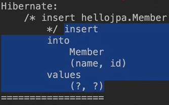

# flush
영속성 컨텍스트의 변경 내용들을(쌓아둔 쿼리문들 같은) 데이터베이스에 반영하는 것!

> 데이터베이스 트랜젝션이 커밋되면 flush가 자동으로 발생됨.

## 플러시 발생 시 메커니즘
---
- 먼저 변경을 감지한다. → Dirty Checking
- 수정된 엔티티를 쓰기 지연 SQL 저장소에 등록한다.
- 쓰기 지연 SQL 저장소의 쿼리를 데이터베이스에 전송한다.
(등록, 수정, 삭제 쿼리)

## 영속성 컨텍스트를 플러시하는 방법
---
> 직접 쓸 일은 거의 없을 것. 테스트 시 사용
- em.flush() 사용 시 : 직접 호출
- 트랜잭션 커밋 시 : 플러시 자동 호출
- JPQL 쿼리 실행 시 : 플러시 자동 호출

```java
Member member = new Member(200L, 'member200');
em.persist(member); //저장

em.flush(); //강제로 호출

System.out.println("====================");
tx.commit();
```
트랜젝션에 커밋되기 전까지 쿼리를 볼 수 없는데 미리 DB에 반영을 하고 싶을때, 쿼리를 미리 보고 싶을 때 `em.flush();`로 강제 호출한다. 그럼 플러시 메커니즘이 즉시 일어나게 된다. 

결과 화면 :  
  

커밋되기 전에 insert 쿼리문으로 DB에 바로 반영이 됨.

flush를 하게 되도 1차 캐시는 그대로 유지가 된다. 오직 영속성 컨텍스트 안에 쓰기 지연 SQL 저장소에 있는 쿼리문들이 반영이 되는 과정이라고 보면 된다. 

### JPQL 쿼리 실행시 플러시가 자동으로 호출되는 이유

```java
em.persist(memberA);
em.persist(memberB);
em.persist(memberC);
//== 요까지는 실제 DB에 반영 x

//중간에 JPQL 실행하게 된다면!?
query = em.createQuery("select m from Member m", Member.class);
List<Member> members= query.getResultList();
```
`em.persist()`만으로는 DB에 쿼리문 자체도 날라가지 않고 반영이 되지도 않은 상태인데 중간에 쿼리문으로 조회하게 된다면 DB에서 가져올게 없음.. 
JPA가 이런 문제를 방지하고자 JPQL을 사용한다면 무조건 flush를 자동으로 실행시킨다.

## 플러시 모드 옵션
---
```java
em.setFlushMode(FlushModeType.COMMIT)
```
- `FlushModeType.AUTO`  
    커밋이나 쿼리를 실행할 때 플러시(기본값)
- `FlushModeType.COMMIT`  
    커밋할 때만 플러시
    쿼리를 실행할 때는 플러시 x

    위의 상황에서 JPQL이 다른 존재하는 DB 객체를 불러온다면? 굳이 위의  memberA,B,C는 flush할 필요가 없다. 

    하지만 가급적 AUTO로 ..

## 플러시는!
---
- **영속성 컨텍스트를 비우지 않음**
- 영속성 컨텍스트의 변경내용을 데이터베이스에 **동기화**
- **트랜잭션이라는 작업 단위**가 중요 -> 커밋 직전에만 동기화(쿼리문으로 상태 업데이트)하면 됨

