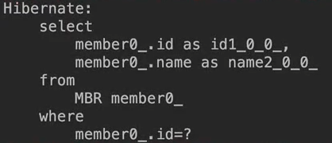

### 엔티티 매핑 
- 객체와 테이블 매핑: @Entity, @Table
- 필드와 컬럼 매핑: @Column
- 기본 키 매핑: @Id
- 연관관계 매핑: @ManyToOne, @JoinColumn

# 객체와 테이블 매핑

## @Entity, 완전 필수 ✔
- @Entity가 붙은 클래스는 **JPA가 관리**한다. 
- JPA를 사용해서 테이블과 매핑할 클래스는 @Entity 필수로 붙여야함
!
### 주의
- **기본 생성자는 필수**(파라미터가 없는 public 또는 protected 생성자)  
*JPA 스펙상 규정됨
- final 클래스, enum, interface, inner 클래스 사용 못함
- 저장할 필드에는 final 사용안됨

## @Entity 속성 정리
- 속성 : name  
`@Entity(name="")`
- JPA에서 사용할 엔티티 이름을 지정한다.
- 기본값: **클래스 이름**을 그대로 사용(예: Member)
- 같은 클래스 이름이 없으면 가급적 기본값을 사용한다. 그냥 @Entity만 적어도 상관 없음


하지만 매핑할 테이블과 엔티티의 이름이 다르다면!? Table 어노테이션 사용!

## @Table
- @Table은 엔티티와 매핑할 테이블 지정

| 속성 | 기능 | 기본값 |
| ---- | ---- | ---- |
| name | 매핑할 테이블 이름 | 엔티티 이름을 사용| 
| catalog | 데이터베이스 catalog 매핑
schema | 데이터베이스 schema 매핑| | 
| uniqueConstraints (DDL) | DDL 생성 시에 유니크 제약 조건 생성 | 

```java
@Entity
@Table(name = "MBR")
public class Member {

}
```
Member객체가 MBR이라는 테이블과 매핑된다.

조회시 ↓ ↓ ↓ 아래와 같이 이름이 MBR인 테이블과 연결이 된다. 
