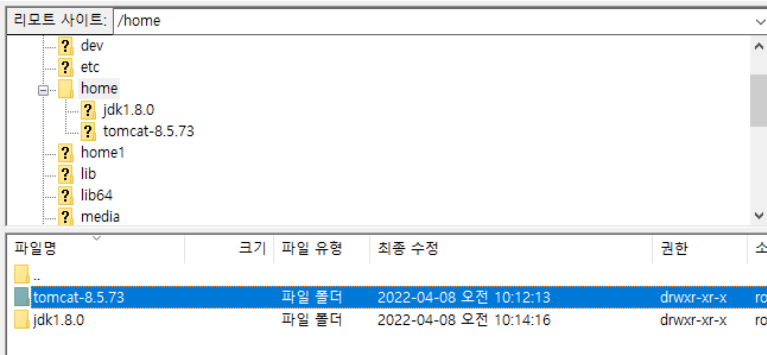
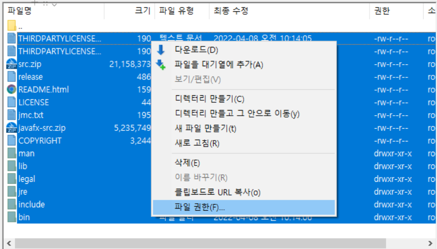
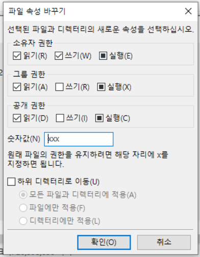

- [x] tomcat / JDK 설치 
- [x] JAVA 버전 확인
- [x] JAVA 환경 변수 설정
- [x] DB 연결


신규서버에 배포하려고 했는데 

`shutdown`

하니까 그 이후부터 안됨  
알고보니 서버를 끈거임 ㄷㄷ

앞으로 ./shutdown.bat 잘보고 끄자..

  

tomcat webapps안에 war 파일 넣고 이제 PuTTY로 돌릴려고 보니까 startup아 아예 뜨지가 않았다.

아래 권한 설정을 보니 실행이 체크 되어 있지 않아서 체크하고 다시 보니까 다시 뜸!

  




### 실행 안됨 → 버전 에러
```jsx
Exception in thread "main" java.lang.UnsupportedClassVersionError:  has been compiled by a more recent version of the Java Runtime (class file version 55.0), this version of the Java Runtime only recognizes class file versions up to 52.0
```

55 = Java 11

52 = Java 8

로컬PC에 자바 버전이 8로 운영중이란 뜻임.
11로 다시 설치하면된다.

[jar 을 실행할때 에러가 발생해요 - 인프런 | 질문 & 답변](https://www.inflearn.com/questions/53693)


## java_home환경 변수 설정

참고 : [5. 리눅스 환경변수(path) 설정](https://m.blog.naver.com/occidere/220821140420)

### 1. 환경변수 임시 적용(export)

```
export 환경변수명=값
```

예를들어 TOMCAT_HOME이라는 환경변수를 /usr/lib/tomcat/tomcat1.8/ 로 지정하려면,

export JAVA_HOME=/home/tomcat/tomcat1.8/ 을 터미널에 입력하면 된다.

### **2. 환경변수 영구 적용**

export를 사용해 환경변수를 넣어주는 방법은 일시적인 방법이다. 시스템을 재부팅하거나, 다음에 다시 로그인하면 환경변수는 사라져 있을 것이다.

영구적으로 모든 사용자가 계속 사용할 수 있는 환경변수를 적용하고자 하면 ,

```
vi /etc/profile
```

profile 파일 마지막에

```
export JAVA_HOME=/home/tomcat/tomcat1.8/ 
```
경로를 적어준다.
etc/profile은 실행시 제일 먼저 열어보는 파일임

참고 : [리눅스 수업 22일차 (1) - 리눅스에서 Java 설치하기](https://lureout.tistory.com/383)

### Error: Could not find or load main class ${start-class}

바본가...계속 java -jar로 실행하고 있었다.

다시 ./startup.sh하고 


## 로그 확인 명령어 
IDE처럼 로그 찍히는거 확인 하려면 logs/catalina.out 파일에서 확인한다. 

명령어는

```jsx
vi /home/tomcat/logs/catalina.out~ 등 경로
```