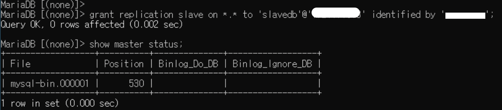
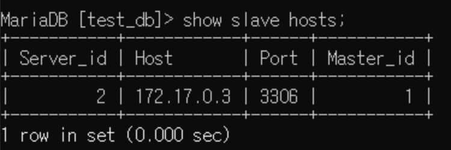

## 1. MariaDB 설치

---

3306포트를 쓰기 때문에 로컬 mariadb 서비스 수동으로 변경  

참고 : [https://pythontoomuchinformation.tistory.com/311](https://pythontoomuchinformation.tistory.com/311)

이후 서비스는 계속 수동으로 시작하면 됨

### 1.1 docker에 mysql 설치

```
docker pull mysql
```

### 1.2 container 생성

**기본 :**

```
docker run --name {이름} -e MYSQL_ROOT_PASSWORD={비번} -d -p {외부포트}:{내부포트3306} mariadb:latest 
```

왠진 모르겠는데 mysql말고 mariadb로 해야 apt-get update 할 수 있음 


**master / slave 이렇게 2개 생성함**
```
docker run -p 3306:3306 --name mariadb -e MARIADB_ROOT_PASSWORD={비밀번호} -d mariadb
docker run -p 3306:3306 --name mysql-master -e MARIADB_ROOT_PASSWORD=maponrex -d mariadb

docker run -p 13306:3307 --name mysql-slave -e MARIADB_ROOT_PASSWORD=maponrex -d mariadb
```

*참고
- -p 3306:3306 : 호스트와 컨테이너의 포트를 연결(포워딩) < host port number:container port number >  
- --name mariadb : 컨테이너 이름을 mariadb로 설정  
- -e MARIADB_ROOT_PASSWORD={비밀번호} : 컨테이너 내 환경변수 설정. mariadb의 비밀번호 지정.  
- -d: 백그라운드 모드  

<br>

현재 구동중인 컨테이너 확인
```
docker ps

CONTAINER ID        IMAGE               COMMAND             CREATED             STATUS              PORTS               NAMES
cdfb9b9576cf        mariadb:latest       "/bin/bash"         2 minutes ago       Up 2 minutes                            master-db
```

### 1.3 container 접속

```
docker exec -it mariadb bash
```

### 1.4 각 container 호스트 확인
```
hostname -I 
```

### 1.5 vi 편집기 설치
/etc/my.cnf 를 수정해야하기때문에 따로 설치해줘야함

[https://javacpro.tistory.com/75](https://javacpro.tistory.com/75)

```
apt-get update
apt-get install vim
```

### 1.6 mysql 접속
docker mysql 접속

```sql
mysql -u root -p
```

<br><br> 

## 2. 양쪽 DB의 데이터 동일시키기

이중화 하기전에 양쪽의 데이터를 동일하게 맞춰주고 시작한다.   
docker인 경우 아래와 같이 데이터를 export import할 수 있다. 

### 2.1 직통으로  mysql export import 하기

F:\danbi\에 잠깐 담아두고 보냄 

```
# 1. master db에 있는 내용을 고대로 덤프해서
# export 
docker exec master-db mysqldump -u root -p {Schema이름} > F:\danbi\db.sql

# 2. slave db에 넣어줌 
# import
docker exec -i slave-db  mysql -u root  -p  {Schema이름} < F:\danbi\db.sql

```

참고 : [how to dump and restore a mariadb mysql database from a docker container](https://davejansen.com/how-to-dump-and-restore-a-mariadb-mysql-database-from-a-docker-container/)

<br><br> 

## 3. Master DB 설정
### 3.1 /etc/mysql/my.cnf 수정하기

```
[mariadbd]
log-bin= mysql-bin
server-id=1
```
server-id로 구분 지어주는 것임

서버 재시작 
```
docker restart master-db
```
docker가 아니고 centos7에서는
```
systemctl restart mysql.service
```
처럼 그냥 mysql 서비스만 재실행 해도 됨

### 3.2 slave에서 접속할 계정 생성 및 권한 주기

```sql
mysql> grant replication slave on *.* to 'slavedb'@'slavedb의 host IP' identified by 'password123';
```

### 3.3 binay log 확인

```jsx
show master status;
```
  

file명과 position 번호 기억하기 
곧 slave db 에서 설정할 때 쓰임

**‼️DB 재시작 시 file명과 position 번호가 변경될 수 있음‼️**

<br><br> 


## 4. Slave DB 설정

### 4.1 /etc/mysql/my.cnf 수정하기

```
[mariadbd]
server-id=2
log-bin = mysql-bin
#master-host = 'master host ip'
#master-port = 3306
#master-user = '아이디'
#master-password = '비밀번호'
replicate-do-db='복제할 스키마 이름'
```
저장 후 똑같이 재시작 해줌 


### 4.2 mater 연동 설정 마스터정보 슬레이브에 등록

```sql
mysql > change master to
    -> MASTER_HOST='172.17.0.2',
    -> MASTER_USER='slavedb',
    -> MASTER_PASSWORD='maponrex',
    -> MASTER_PORT=3306,
    -> MASTER_LOG_FILE='mysql-bin.000001',
    -> MASTER_LOG_POS=530;
```

### 4.3 slave 실행

```sql
mysql> start slave;
```

### 4.4 slave 상태 확인

```
MariaDB [(none)]> show slave status\G;
*************************** 1. row ***************************
                Slave_IO_State: 여기서 연결중이라고 뜸
                   Master_Host: 172.17.0.2
                   Master_User: slavedb
                   Master_Port: 3306
                 Connect_Retry: 60
               Master_Log_File: mysql-bin.000001
           Read_Master_Log_Pos: 530
                Relay_Log_File: mysqld-relay-bin.000001
                 Relay_Log_Pos: 4
         Relay_Master_Log_File: mysql-bin.000001
              Slave_IO_Running: No
             Slave_SQL_Running: Yes
               Replicate_Do_DB:
           Replicate_Ignore_DB:
            Replicate_Do_Table:
        Replicate_Ignore_Table:
       Replicate_Wild_Do_Table:
   Replicate_Wild_Ignore_Table:
                    Last_Errno: 0
                    Last_Error:
                  Skip_Counter: 0
           Exec_Master_Log_Pos: 530
               Relay_Log_Space: 256
               Until_Condition: None
                Until_Log_File:
                 Until_Log_Pos: 0
            Master_SSL_Allowed: No
            Master_SSL_CA_File:
            Master_SSL_CA_Path:
               Master_SSL_Cert:
             Master_SSL_Cipher:
                Master_SSL_Key:
         Seconds_Behind_Master: NULL
 Master_SSL_Verify_Server_Cert: No
                 Last_IO_Errno: 얘랑
                 Last_IO_Error: 얘에서 오류나는지 확인
                Last_SQL_Errno: 0
                Last_SQL_Error:
   Replicate_Ignore_Server_Ids:
              Master_Server_Id: 1
                Master_SSL_Crl:
            Master_SSL_Crlpath:
                    Using_Gtid: No
                   Gtid_IO_Pos:
       Replicate_Do_Domain_Ids:
   Replicate_Ignore_Domain_Ids:
                 Parallel_Mode: optimistic
                     SQL_Delay: 0
           SQL_Remaining_Delay: NULL
       Slave_SQL_Running_State: Slave has read all relay log; waiting for more updates
              Slave_DDL_Groups: 0
Slave_Non_Transactional_Groups: 0
    Slave_Transactional_Groups: 0
1 row in set (0.000 sec)

ERROR: No query specified
```

## 4.5 read only로 설정해주기

이제 slave DB에서 조회만 가능하도록 설정해야함 

**1. slave db의 복제 스키마에서 아래 코드 실행**
```sql
set global read_only=1;
```

**2. /etc/my.cnf에도 추가해주기**
```
[mariadbd]
server-id=2
log-bin = mysql-bin
#master-host = 'master host ip'
#master-port = 3306
#master-user = '아이디'
#master-password = '비밀번호'
replicate-do-db='복제할 스키마 이름'
read-only=1
```

<br><br>

🙈 Tip !

master db에서 

```
 mysql> show slave hosts;
```

하면 슬레이브서버 가나옴



안되면 master의 my.cnf에 report-host=hostname 넣기


<br>

## 5. Error Error

1. 에러1

```
Last_IO_Error: Fatal error: The slave I/O thread stops because master and slave have equal MariaDB server ids; these ids must be different for replication to work (or the --replicate-same-server-id option must be used on slave but this does not always make sense; please check the manual before using it).
```

해결

서버아이디가 중복되어 있다길래

```
show global variables like 'server_id';
```

라고 쳐보니까 slavedb 도 server_id가 둘 다 1이 었다. 

그래서 다시 재부팅했더니 정상적으로 server_id=2가 적용됨

---

2. 에러2

```
Last_Errno: 1050
Last_Error: Error 'Table 'user_tb' already exists' on query. Default database: 'test_db'. Query: 'rename table user_db to user_tb'
```

사실 뭔지 잘 모르겠지만 

마스터 db에서 

```
> show master status;
하고 나오는 Position 번호가 1660인 것을 확인하고
```

슬레이브 db에서

```
stop slave;
change master to MASTER_LOG_POS=1660;
docker restart slavedb;

로 해줌

나중에는 그냥 systemctl restart mysql.service 하면 될듯  
```

---

3. 마스터 슬레이브 다됐는데 연결을 못함

포트를 잘못 설정한거였음…

master에서 포트 확인하고 

```sql
SHOW GLOBAL VARIABLES LIKE 'PORT';
```

```
master change to 
master_port=3306
```

로 바꿔줌