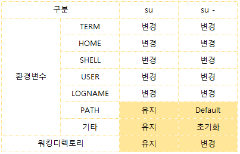

보통 리눅스에서 사용자 계정으로 로그인 후
관리자 root 권한으로 변경할 때

`su - root`를 치곤 했다.

하지만 오늘 보니 su 까지만 쳐도 root로 변경이 가능하고 su 와 su - 에 차이가 있다고 한다. 


## su [사용자 ID]
우선 su는 substitute user의 줄임말이다. 
현 사용자를 로그아웃 하지 않고, 다른 사용자의 권한을 획득할 때 사용한다. 

```
su [사용자 ID]
```

su 뒤에 변경할 ID를 입력하지 않는다면 su root와 동일하게 실행된다. 

아 그리고 일반 계정쉘에서는 $가 보이다가 su root로 변경된 후 관리자 계정일 때는 쉘이 #로 보임.

```
$ su       //root 권한 변경 실행, 이땐 $
Password:  //pw치고 로그인 성공
# exit     //성공 후 #로 변경, exit실행하면 이전 로그인계정으로 다시 돌아감
logout 
$          //일반 계정 쉘

```

## su - [사용자 ID]
자 이제 su 뒤에 -를 붙이면 동작방식이 달라진다.   
여기서 `'-'` 의미는 뭘까?

`‘-’`

`‘-l’`

`‘--login’`

`‘-’`는 `-l` 혹은 `--login`과 동일한 명령어로 즉,  
`su -`는 `su --login root`와 동일한 명령이다.

`‘-’`의 유무는 **환경변수**와 **워킹 디렉토리**에 영향을 줍니다.

  


환경변수 TERM, HOME, SHELL, USER, LOGNAME는,
`su`나 `su -`나 모두 변경된 사용자 ID에 맞게 재설정된다.

HOME과 SHELL은  /etc/passwd 에서 변경할 사용자의 정보를 가져와서 설정.
USER와 LOGNAME은 변경할 사용자계정을 입력.

### 차이점 1) PATH 경로
PATH
`su` 에선 변경 전후가 동일   
`su -`에선 PATH가 컴파일시 설정한 default 값으로 설정

그 외의 환경변수에서 분명한 차이가 있다.

su는 기존 사용자 환경에서 설정된 환경변수를 그냥 그대로 유지합니다.

그에 반해, su -는 기존 사용자 환경에서 사용하던 환경변수를 모두 지워버립니다.


$ export hello=tizen
$ su
암호: 
# echo $hello
tizen
# exit
$ su -
# echo $hello
(null)

위의 예를 살펴보시죠.

기존 사용자 계정에서 hello라는 변수에 tizen이라는 값을 넣어두었습니다.

그리고 su로 관리자 계정으로 변경합니다.

su는 기타 환경변수를 유지하기 때문에 hello의 환경변수값이 tizen으로 나오겠지요?

위의 예에서도 echo $hello를 하니 tizen이 나오네요.


그리고 exit하여 원래 계정으로 복귀한 후,

이번엔 su -를 합니다.

그리고 echo $hello를 해봅니다.

이번에는 아무 것도 나오지 않네요.

--login 옵션으로 환경변수가 정리되었기 때문입니다.


그리고, su는 워킹디렉토리를 변경하지 않습니다.

반면 su -는 변경한 사용자 계정의 홈디렉토리로 이동하게 됩니다.


$ pwd
/tmp
$ su
암호: 
# pwd
/tmp
# exit
exit
$ su -
암호: 
# pwd
/root


최초에 /tmp 디렉토리에 있었고,

su를 해도 여전히 /tmp에 머물고 있습니다.

하지만, su -를 하면, 관리자 계정의 홈디렉토리인 /root로 이동하게 됩니다


위의 차이점을 알고 사용하면 됩니다.

워킹디렉토리는 cd로 변경하면 그만이니,

환경변수 설정부분만 유의하면 되겠네요.

환경변수는 빌드/실행에 영향을 줄 수 있으니까요.


출처: https://storycompiler.tistory.com/44 [아프니까 개발자다]