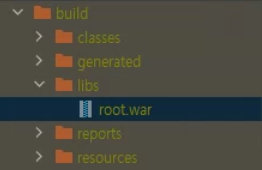

스프링 부트는 내장 톰켓이 존재하여 jar를 이용한 손쉬운 배포가 가능하다. 외부 톰켓을 이용하여 배포해야하는 경우에는 WAR를 이용한 배포를 하는 경우가 많다. 


### 개발 환경 
- Framework  : Spring boot  
- Build Tool : Gradle  
- IDEA       : Intellj   
 

## build.gradle 설정
우선 build.gradle 파일에 아래의 내용을 추가해준다.

```gradle
plugins {
	id 'org.springframework.boot' version '2.6.3'
	id 'io.spring.dependency-management' version '1.0.11.RELEASE'
	id 'java'
    id 'war' // <-- 추가 
}

war {  <-- 추가 
    archiveBaseName = 'root' // <--war 패키징 시 이름 설정 
    archiveFileName = 'root.war' //<--war 패키징 시 이름 설정 
    archiveVersion = "0.0.0"
}


// 내장톰켓을 사용하지 않음.. (providedRuntime)
providedRuntime 'org.springframework.boot:spring-boot-starter-tomcat' 
```

## SpringBootServletInitializer 상속
그리고 플젝Application.class에 `SpringBootServletInitializer` 를 상속 받고 configure를 @Override 한다.

```java
@SpringBootApplication
public class WebApplication extends SpringBootServletInitializer {

    public static void main(String[] args) {
        SpringApplication.run(WebApplication.class, args);
    }

    @Override
    protected SpringApplicationBuilder configure(SpringApplicationBuilder builder) {
        return super.configure(builder);
    }
}
```

## Gradle > bulid 실행 

  

왼쪽 Project에서 bulid/libs 를 확인하면 설정한 root.war 파일을 이용하여 Tomcat에 올려서 구동한다.

*terminal에서 war 실행   
build > libs  폴더로 이동, 아래 명령어 실행

```
 java -jar ./root.war
```


## ref
[Spring boot Gradle 을 이용한 WAR 배포 : [pooney]](https://pooney.tistory.com/74)