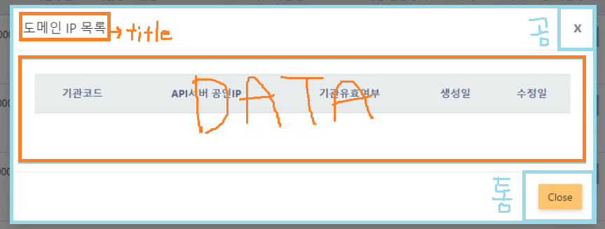

## 모달 호출 컴포넌트

우선 모달을 띄울 컴포넌트에서 아래와 같이 data-toggle이 modal로 설정되있고 data-target은 modal1라는 아이디 값으로 불러온다. 이부분은 디자인하시는 분이 해서 자세히는 모르지만 대충 저 두개의 속성으로 모달을 띄우는 것 같다. 
```jsx
{
    currentPosts.map((boards, idx) => (
        <>
            <td>
                <button type="button" 
                        className="btn btn-sm btn-success" 
                        data-toggle="modal" 
                        data-target="#modal1" 
                        onClick={()=>{
                            setCode(boards.code)
                            }}>
                    모달 클릭
                </button>
            <td>
        </>
    )
}

<Boards code={code}>
```
당시 버튼이 있는 행에서 넘겨줘야하는 파라미터가 있었기 때문에 onClick시 필요한 데이터를 set해주고 공통 모달 안에 보여줄 데이터가 있는 Boards 컴포넌트를 호출한다. 


## 모달 데이터 컴포넌트

```jsx
import React, { useEffect, useState } from 'react';
import Pagination from './Pagination';
import axios from 'axios';
import moment from "moment";
import Modal from './Modal';

                //1. 상위 컴포넌트에서 넘겨온 props를 받음
const Boards = (props) => {

    const [boards, setBoards] = useState([]);

    useEffect(() => {
        axios.get("/boardslist?code=" + props.code) //2. 서버에 code를 query string으로 보냄
            .then((res) => {
                //3. 이후 서버에서 code로 조건절을 이용하여 나온 값들을 json으로 반환함
                setBoards(res.data);
            })
            .catch((error) => {
                console.log(error);
            });
    }, [props.code]);

return(

//4. 모달 컴포넌트를 호출하고 props로 모달 페이지의 title, 고유한 id값, 안에 넣을 data를 보냄 
    <Modal title="모달 1" id="modal1" 
        data={
            <div className="modal-body">
                <div className="table-responsive">
                    <table className="table">
                        <thead className="thead-light">
                            <tr className="text-center">
                                <th>th</th>
                                <th>th</th>
                            </tr>
                        </thead>
                        <tbody>
                            {currentPosts.map((boards, idx) => (
                                    <tr key={idx} className="text-center">
                                        <td>td</td>
                                        <td>td</td>
                                    </tr>
                                ))
                            }
                        </tbody>
                    </table>
                </div>

                <Pagination />

            </div>
    }/>
        
    );
}
export default Boards;
```
 
## 모달 틀 컴포넌트

```jsx
import React, {useState, useEffect} from 'react';

//1. props로 제목, id값, 데이터를 넘겨받는다. 
const Modal = ({title, id, data}) => {
 
    return ( 
        <>
                //아이디 값
            <div id={id} className="modal fade" tabIndex="-1" role="dialog" aria-labelledby="vcenter" aria-hidden="true">	
                <div className="modal-dialog modal-dialog-centered modal-lg">	
                    <div className="modal-content">	
                        <div className="modal-header">	
                            <h4 className="modal-title" id="vcenter">{title}</h4>	// 제목
                            <button type="button" className="close" data-dismiss="modal" aria-hidden="true">x</button>	
                        </div>	

                        <div className="modal-body">
                            {data} // 넘겨받은 데이터 출력
                        </div>

                        <div className="modal-footer">
                            <button type="button" className="btn btn-warning waves-effect" data-dismiss="modal">Close</button>
                        </div>

                     </div>	
                </div>	
            </div>
        </>
     );
}

export default Modal;
```

아래 그림과 같이 보면 될 것 같다.



