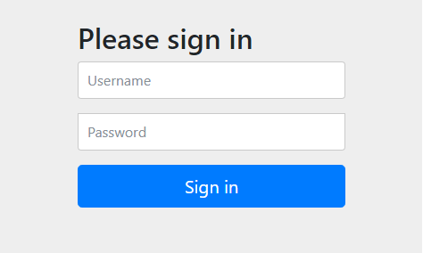

## 기본 세팅
- build.gradle에 스프링 시큐리티 추가
```
implementation 'org.springframework.boot:spring-boot-starter-security'
```

- SpringSecurityConfig 클래스 생성
```java
@Configuration
@EnableWebSecurity
public class SpringSecurityConfig extends WebSecurityConfigurerAdapter {
    @Override
    protected void configure(HttpSecurity http) throws Exception {
        http
                .authorizeRequests()
                    .anyRequest().authenticated()
                .and()
                    .formLogin()
                    .defaultSuccessUrl("/view/dashboard", true)
                    .permitAll()
                .and()
                    .logout();
    }
}
```
- WebSecurityConfigurerAdapter를 상속한다. (클래스명 상관 x)
- 어노테이션 @Configuration, @EnableWebSecurity 추가.
- 각종 설은 `WebSecurityConfigurerAdapter`에 오버로딩 되어 있는 다양한 configure 함수를 오버라이드 해서 설정할 수 있다. 
    - `configure(HttpSecurity http)` : HttpSecurity만 인자로 가지는 configure를 오버라이딩 한다.

- `.anyRequest().authenticated()` : 어떠한 URI로 접근하던지 인증이 필요함을 설정함.
- `formLogin()` : 폼 방식 로그인을 사용할 것임을 알리고, logout도 필요하니 logout도 추가함.
- `defaultSuccessUrl` : 로그인 성공 시 이동할 uri를 설정함.

## 스프링 시큐리티 예외 처리
서버를 클라우드에 올리는 경우 등 로그인 없이 접근 가능해야하는 URI가 있다면 스프링 시큐리티에서 인증을 진행하지 않아야만 정상적으로 처리가 가능하다.  
SpringSecurityConfig에 `.antMatchers("/uri").permitAll()`와 같이 예외를 설정할 수 있습니다.

또 css나 이미지 파일 등의 경우 인증이 되지 않은 상태에서도 보여져야 하는 경우가 대부분이다. 이 경우 별도로 WebSecurity 하나를 인자로 갖는 configure를 오버라이딩해서 예외 처리를 할 수 있습니다.

```java
@Configuration
@EnableWebSecurity
public class SpringSecurityConfig extends WebSecurityConfigurerAdapter {
    @Override
    protected void configure(HttpSecurity http) throws Exception {
        http
                .authorizeRequests()
                    .antMatchers("/uri").permitAll()    // LoadBalancer 
                    .anyRequest().authenticated()
                .and()
                    .formLogin()
                    .defaultSuccessUrl("/view/dashboard", true)
                    .permitAll()
                .and()
                    .logout();
    }

    @Override
    public void configure(WebSecurity web) throws Exception {
        web.ignoring().antMatchers("/static/js/**","/static/css/**","/static/img/**","/static/frontend/**");
    }
}
```
로그인 페이지를 **커스텀 페이지로 변경해둔 경우**, WebSecurity 예외처리를 하지 않을 경우 다음과 같이 화면이 깨지게 됩니다.

## 로그인 화면을 커스텀 페이지로 변경

  

<span style="color:gray">스프링 시큐리티에서 기본적으로 제공해주는 화면</span>

```java
    .and()
        .formLogin()
        .loginPage("/loginpage") //커스텀 페이지로 변경
        .loginProcessingUrl("/loginproc")
        .usernameParameter("id")
        .passwordParameter("pw")
        .defaultSuccessUrl("/view/dashboard", true)
        .permitAll()
```

- `.loginProcessingUrl("/loginproc")` : 별도로 Controller에 만들어야 하는게 아니고, formLogin 방식이므로 **해당 주소를 어디로 처리할지** 정해주는 겁니다. 그럼 저 `/loginpage`에서 `<form method="post" action="/loginproc">`와 같이 form의 action을 정해주면 알아서 스프링 시큐리티쪽으로 id와 pw를 보내게 됩니다.

- `.usernameParameter("id")`는 유저 아이디에 해당하는 form의 name을 변경합니다. 이 부분은 없어도 되며, 그럼 default는 `username` 입니다. 위와 같이 변경했다면 input은 `<input type="text" name="id">` 처럼 되겠네요.

- `.passwordParameter("pw")`는 마찬가지로 유저 비밀번호 부분에 해당합니다. input은 `<input type="password" name="pw">` 처럼 되겠네요.

## 유저 ROLE에 따라서 접근제어

- `.antMatchers("/manage").hasAuthority("ROLE_ADMIN")` : 해당 사용자가 ADMIN의 role을 가지고 있어야만 `/manage` 이하의 uri에 접근 가능하게 됩니다. ROLE은 DB에 넣어두면 된다. 

참고 : 


## logout 커스텀
logout시 호출하는 uri도 변경할 수 있습니다.

- `.logoutRequestMatcher(new AntPathRequestMatcher("/logoutproc"))` 부분 처럼 처리하면 `/logoutproc`을 호출할 시 로그아웃이 되고, 그럼 인증된게 사라지니 다시 로그인 페이지로 자동으로 이동되게 되는 것입니다. 이 부분은 생략 가능해서 이렇게 서브로 넣었습니다.  
*생략 시 default로 `/logout` 호출 시 로그아웃 가능.


### 참고 사이트  
https://nahwasa.com/entry/%EC%8A%A4%ED%94%84%EB%A7%81%EB%B6%80%ED%8A%B8-Spring-Security-%EA%B8%B0%EB%B3%B8-%EC%84%B8%ED%8C%85-%EC%8A%A4%ED%94%84%EB%A7%81-%EC%8B%9C%ED%81%90%EB%A6%AC%ED%8B%B0